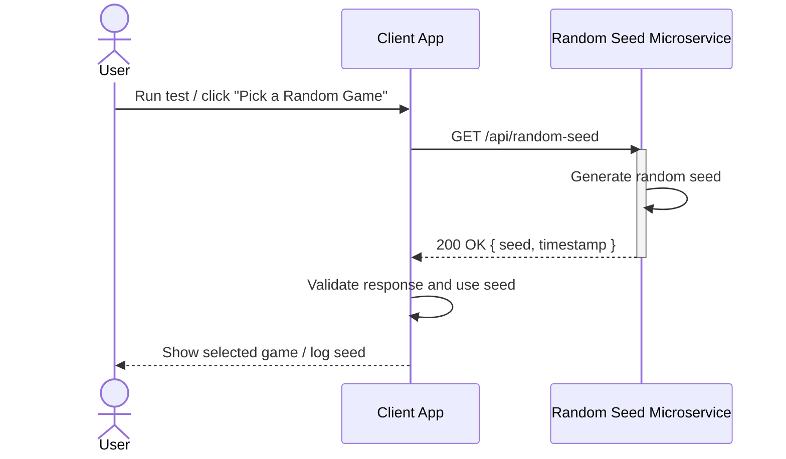

# Random Seed Microservice — Communication Contract

This microservice provides a cryptographically secure random seed integer. Once this communication contract is published, it must not change so other services can rely on it.

---

## How to REQUEST Data (Programmatically)

HTTP Method: GET  
URL: http://localhost:3001/api/random-seed  
Required Header: Accept: application/json

Example Request (Node.js / fetch):

async function requestSeed() {
  const response = await fetch("http://localhost:3001/api/random-seed", {
    method: "GET",
    headers: { "Accept": "application/json" }
  });

  const data = await response.json();
  console.log(data);
}

Example Request (cURL):

curl -X GET "http://localhost:3001/api/random-seed" -H "Accept: application/json"

---

## How to RECEIVE Data (Programmatically)

Expected Successful JSON Response (HTTP 200):

{
  "seed": 123456789,
  "timestamp": "2025-11-17T03:21:45.123Z"
}

Example Usage (Node.js):

async function getSeed() {
  const res = await fetch("http://localhost:3001/api/random-seed");
  const data = await res.json();

  // Expected shape:
  // data.seed      -> number (0 to 2147483647)
  // data.timestamp -> ISO 8601 string

  console.log("Seed:", data.seed);
  console.log("Timestamp:", data.timestamp);
}

---

## Required Response Format

Field | Type | Description
------|------|-------------
seed | integer | Secure random integer used for deterministic RNG
timestamp | string (ISO 8601) | UTC time when the seed was generated

---

## UML Sequence Diagram

